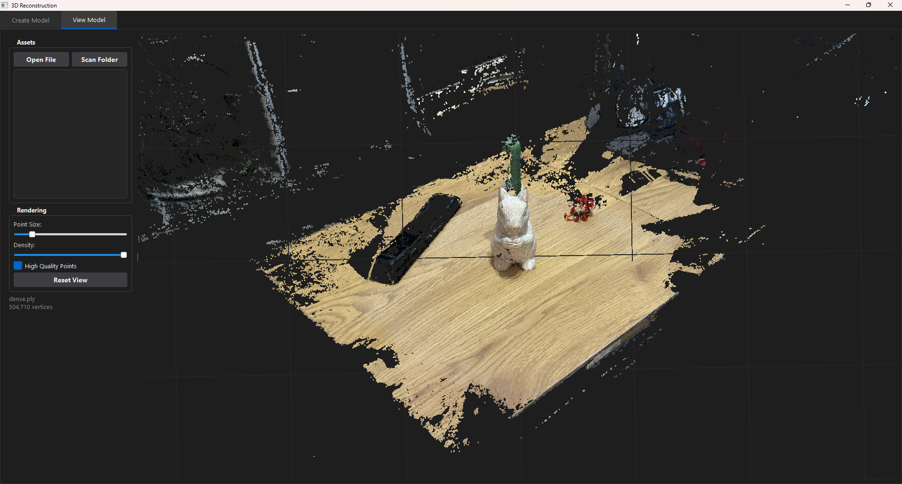
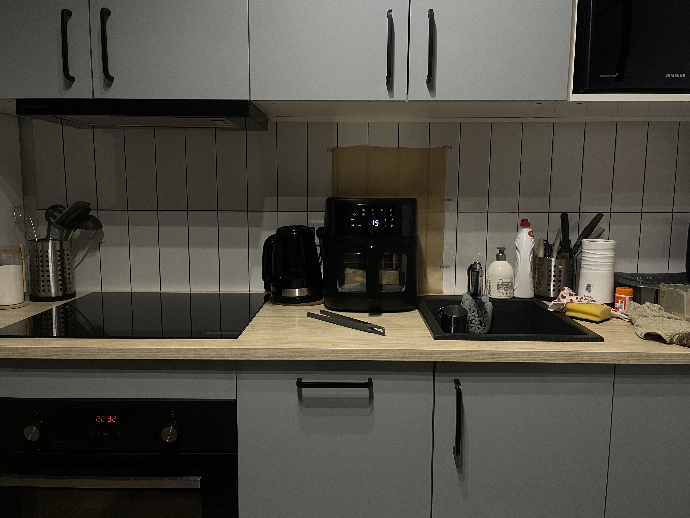
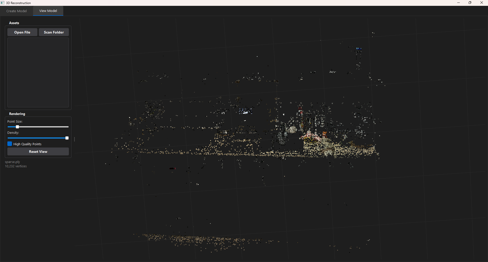
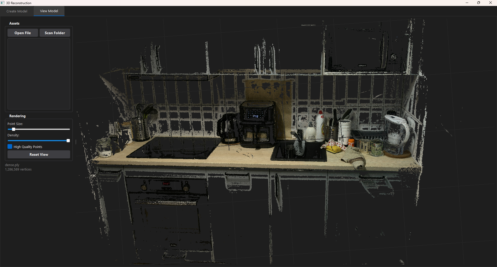
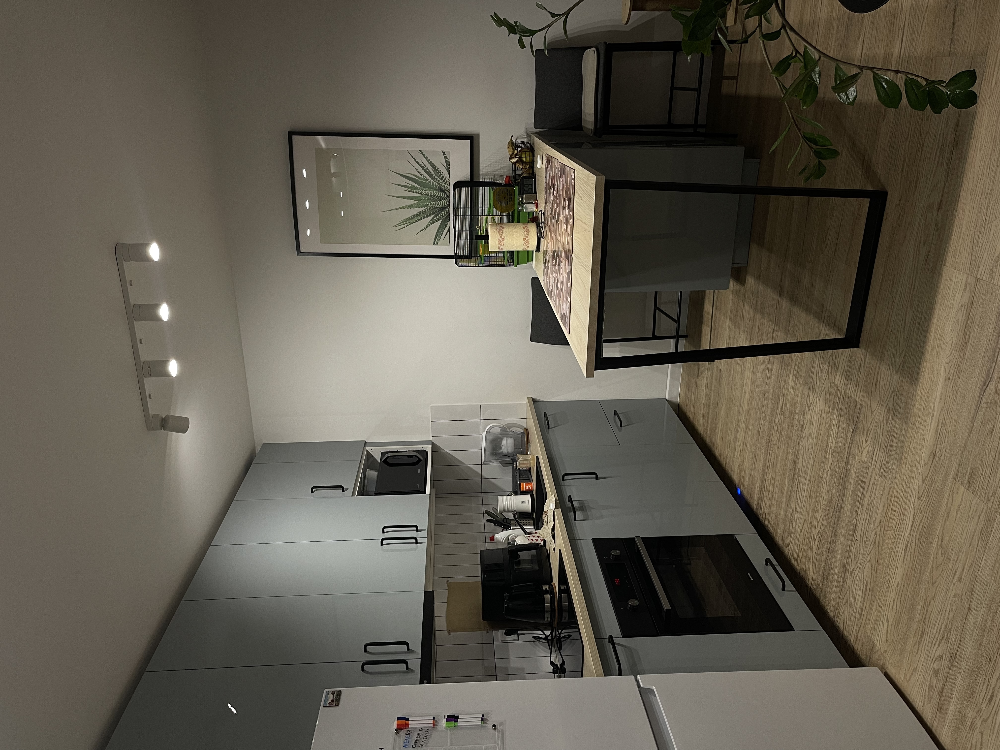
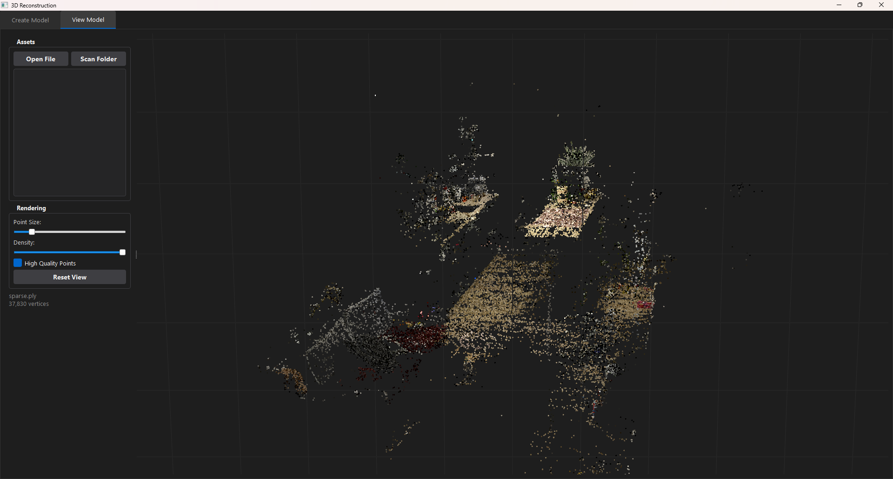
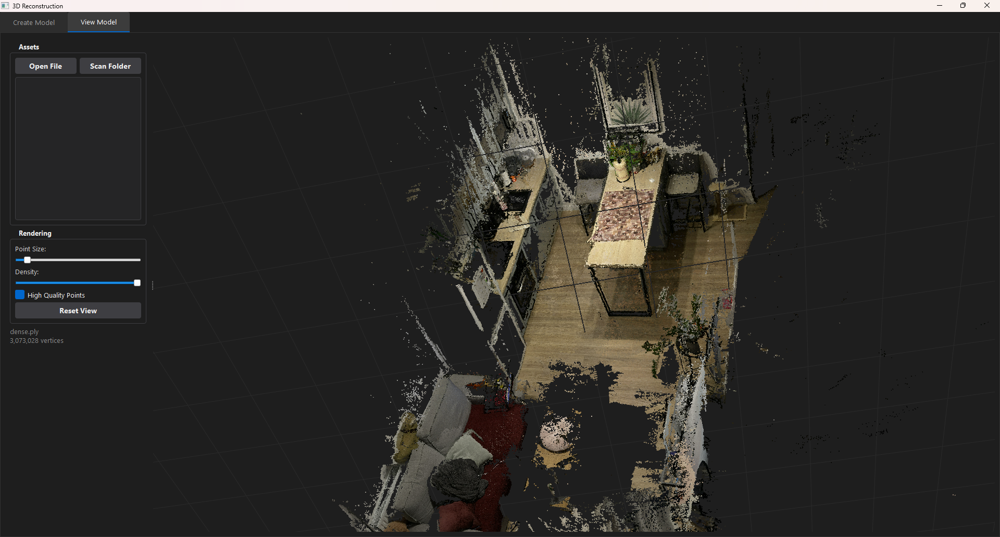
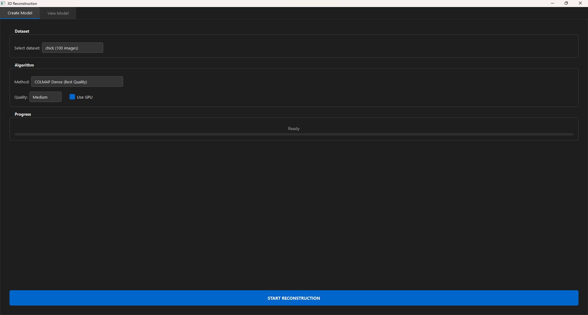
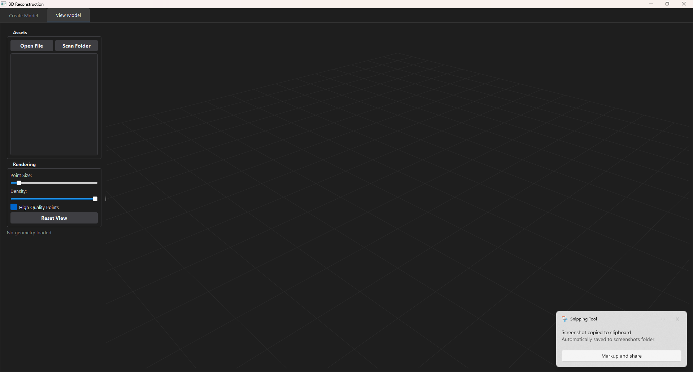

# 3D Reconstruction Tool

<p align="center">
  <strong>Structure from Motion & Dense Reconstruction from 2D Images</strong>
</p>

<p align="center">
  
  
  
  
</p>

---

A PyQt5-based desktop application that reconstructs 3D point cloud models from ordinary 2D images. The project implements a complete pipeline from scratch — camera calibration, feature extraction, incremental Structure from Motion, bundle adjustment, and multiple dense reconstruction methods.

## Results

<table>
  <tr>
    <td align="center"><br><sub>Input photos (squirrel)</sub></td>
    <td align="center"><br><sub>Sparse reconstruction</sub></td>
    <td align="center"><br><sub>Dense point cloud</sub></td>
  </tr>
  <tr>
    <td align="center"><br><sub>Input photos (kitchen)</sub></td>
    <td align="center"><br><sub>Sparse reconstruction</sub></td>
    <td align="center"><br><sub>Dense point cloud</sub></td>
  </tr>
  <tr>
    <td align="center"><br><sub>Input photos (kitchen)</sub></td>
    <td align="center"><br><sub>Sparse reconstruction</sub></td>
    <td align="center"><br><sub>Dense point cloud</sub></td>
  </tr>
</table>

## Application Interface

<table>
  <tr>
    <td align="center"><br><sub>Create Model tab — dataset & algorithm selection</sub></td>
    <td align="center"><br><sub>View Model tab — interactive 3D point cloud viewer</sub></td>
  </tr>
</table>

## How It Works

The reconstruction pipeline transforms a set of 2D images into a 3D point cloud through several mathematically rigorous stages:

### Pipeline Overview

```
Input Images → Calibration → Feature Detection → Feature Matching → SfM → Dense Reconstruction → PLY
     📷            📐             🔍                  🔗            📐           🧊              💾
```

### Stage 1: Camera Calibration

Before reconstruction, the camera's parameters must be known. Using a chessboard pattern, we solve for:

- **Focal lengths** ($f_x$, $f_y$) — how the camera maps 3D to 2D
- **Principal point** ($c_x$, $c_y$) — optical center offset
- **Distortion coefficients** ($k_1$, $k_2$, $p_1$, $p_2$) — lens distortion model

The calibration uses iterative outlier rejection: images with reprojection error above a threshold are removed, and calibration is re-run until convergence.

### Stage 2: Feature Extraction & Matching

Two feature pipelines are supported:

| | **Classical (SIFT)** | **Neural (SuperPoint + LightGlue)** |
|---|---|---|
| **Detector** | Scale-space extrema in DoG pyramid | CNN-based keypoint detector |
| **Descriptor** | 128-dim gradient histogram | 256-dim learned descriptor |
| **Matcher** | FLANN + Lowe's ratio test | Attention-based graph neural network |
| **Strengths** | Reliable, no GPU needed | Handles large viewpoint changes, repetitive textures |
| **Speed** | Fast on CPU | Requires GPU for real-time |

Both pipelines use **geometric verification** with RANSAC to filter outlier matches by estimating the Fundamental matrix $\mathbf{F}$:

$$\mathbf{x'}^\top \mathbf{F} \mathbf{x} = 0$$

### Stage 3: Incremental Structure from Motion (SfM)

The SfM pipeline reconstructs camera poses and sparse 3D structure incrementally:

1. **Initial pair selection** — Find two images with sufficient parallax (1.5°–40°) and good match coverage. The Essential matrix is decomposed into rotation $\mathbf{R}$ and translation $\mathbf{t}$:

$$\mathbf{E} = \mathbf{K}^\top \mathbf{F} \mathbf{K}, \quad \mathbf{E} = [\mathbf{t}]_\times \mathbf{R}$$

2. **Triangulation** — 3D points are recovered from 2D correspondences using DLT (Direct Linear Transform) and refined with reprojection error minimization.

3. **Incremental registration** — New images are added one at a time:
   - Find 2D–3D correspondences via feature tracks
   - Solve camera pose with PnP (Perspective-n-Point) + RANSAC
   - Triangulate new 3D points visible in the new view

4. **Bundle Adjustment** — Joint optimization of all camera poses and 3D points to minimize total reprojection error:

$$\min_{\mathbf{R}_i, \mathbf{t}_i, \mathbf{X}_j} \sum_{i,j} \| \mathbf{x}_{ij} - \pi(\mathbf{R}_i, \mathbf{t}_i, \mathbf{X}_j) \|^2$$

### Stage 4: Dense Reconstruction

Three dense methods are available, each with different quality/speed tradeoffs:

#### Dense SIFT Matching (CPU)
Extracts up to 100K SIFT features per image, matches all camera pairs within a sliding window, and triangulates every match.

#### Plane Sweep Stereo (GPU)
For each reference view, sweeps a set of fronto-parallel depth planes through the scene. At each depth, source images are warped via homography and compared using normalized cross-correlation (NCC). Multi-view consistency filtering ensures points are visible from ≥3 cameras.

#### PatchMatch MVS (GPU, best quality)
Based on the PatchMatch Stereo algorithm:
1. **Random initialization** of depth & surface normal hypotheses per pixel
2. **Spatial propagation** — neighboring pixels share hypotheses (nearby surfaces are likely similar)
3. **View propagation** — project hypotheses to other views for cross-validation
4. **Random refinement** — perturb hypotheses with decreasing search radius
5. **Multi-view consistency filtering** — keep only points confirmed by ≥3 views

### Filtering & Post-processing

All dense methods apply:
- **Statistical outlier removal** — remove points whose k-NN distance exceeds $\mu + 2.5\sigma$
- **Voxel grid downsampling** — deduplicate points falling into the same voxel cell
- **Depth range filtering** — reject points with unreasonable depth values

## Project Structure

```
├── data/
│   ├── samples/                    # Input image datasets
│   │   ├── kitchen/
│   │   ├── room/
│   │   ├── squirrel/
│   │   └── ...
│   └── calibration_images/
│       └── chessboard/             # Chessboard photos for calibration
├── src/
│   ├── core/                       # Reconstruction algorithms
│   │   ├── sfm_pipeline.py         # Incremental SfM pipeline
│   │   ├── features.py             # SIFT feature extraction & matching
│   │   ├── neural_matcher.py       # SuperPoint + LightGlue matcher
│   │   ├── geometry.py             # Epipolar geometry (E/F matrix, triangulation)
│   │   ├── camera.py               # Camera model & projection
│   │   ├── dense.py                # Dense SIFT reconstruction
│   │   ├── dense_stereo.py         # GPU plane sweep stereo
│   │   ├── mvs_patchmatch.py       # PatchMatch MVS
│   │   └── utils.py                # PLY export, scene utilities
│   ├── gui/                        # PyQt5 desktop interface
│   │   ├── main_app.py             # Main window with tabs
│   │   ├── viewer.py               # Interactive 3D point cloud viewer
│   │   └── worker.py               # Background process management
│   ├── calibration/                # Camera calibration tools
│   │   ├── calibration.py          # Calibration with outlier rejection
│   │   └── validate_calibration.py # Per-image error analysis
│   ├── tools/
│   │   └── run_colmap.py           # COLMAP integration wrapper
│   └── run_reconstruction.py       # CLI entry point
└── requirements.txt
```

## Installation

### Basic (CPU only)

```bash
git clone https://github.com/dackey-wav/3d-reconstruction-tool.git
cd 3d-reconstruction-tool
python -m venv venv
pip install -r requirements.txt
```

### With GPU acceleration (recommended)

```bash
pip install -r requirements.txt
pip install torch torchvision --index-url https://download.pytorch.org/whl/cu121
pip install git+https://github.com/cvg/LightGlue.git
```

### Optional: COLMAP integration

Download COLMAP from [github.com/colmap/colmap/releases](https://github.com/colmap/colmap/releases) and add it to your PATH.

## Usage

### 1. Camera Calibration (first time only)

Place chessboard calibration images in `data/calibration_images/chessboard/` and run:

```bash
python -m src.calibration.calibration
```

Validate the result:
```bash
python -m src.calibration.validate_calibration
```

### 2. Create 3D Models

**Option A: GUI (recommended)**
```bash
python -m src.gui.main_app
```
1. Go to the **"Create Model"** tab
2. Select a dataset from the dropdown
3. Choose a reconstruction method and options
4. Click **"START RECONSTRUCTION"**

**Option B: Command line**
```bash
# Place your images in data/samples/<dataset_name>/

# Best quality (neural matching + PatchMatch MVS)
python -m src.run_reconstruction <dataset_name> --neural --mvs

# Faster (neural matching + plane sweep stereo)
python -m src.run_reconstruction <dataset_name> --neural --stereo

# Quick test (sparse only)
python -m src.run_reconstruction <dataset_name> --neural --fast

# Classical SIFT (no GPU required)
python -m src.run_reconstruction <dataset_name> --dense
```

### 3. View Results

```bash
python -m src.gui.main_app
```
Switch to the **"View Model"** tab and open any `.ply` file from the reconstruction output.

> **📦 Pre-built models included:** The repository ships with COLMAP-reconstructed point clouds for three datasets — **squirrel**, **kitchen**, and **room**. After cloning, open the viewer and load files from `data/samples/<dataset>/colmap_reconstruction/` to explore 3D models immediately, no reconstruction needed.

### CLI Options Reference

| Flag | Description |
|------|-------------|
| `--neural` | Use SuperPoint + LightGlue neural matcher |
| `--mvs` | PatchMatch MVS dense reconstruction (best quality, GPU) |
| `--stereo` | Plane sweep stereo (faster, GPU) |
| `--dense` | Dense SIFT matching (slow, CPU) |
| `--fast` | Sparse-only mode with reduced resolution |
| `--max-images N` | Limit number of input images |
| `--output DIR` | Custom output directory |

## Technical Details

### Key Dependencies

| Library | Purpose |
|---------|---------|
| **OpenCV** | Feature detection (SIFT), geometric verification, camera calibration |
| **NumPy / SciPy** | Linear algebra, spatial data structures (KDTree), optimization |
| **PyQt5** | Desktop GUI framework |
| **pyqtgraph + OpenGL** | Real-time 3D point cloud rendering |
| **PyTorch** *(optional)* | GPU acceleration for dense stereo & neural matching |
| **LightGlue** *(optional)* | State-of-the-art learned feature matching |

### Algorithm Parameters

The pipeline exposes several tunable parameters:

- **SIFT**: `n_features=8000`, `contrast_threshold=0.03`, ratio test at `0.75`
- **RANSAC**: reprojection threshold `2.0px`, confidence `0.999`
- **Bundle Adjustment**: 3 iterations of camera refinement with PnP resolving
- **Dense stereo**: 64 depth hypotheses, patch size 5×5, scale `0.25×`
- **PatchMatch**: 3 iterations, min 3 consistent views, scale `0.25×`
- **Outlier filtering**: 20-NN statistical filter at $\mu + 2.5\sigma$

## 📝 License

This project was developed as an educational exercise in multi-view geometry and 3D computer vision.